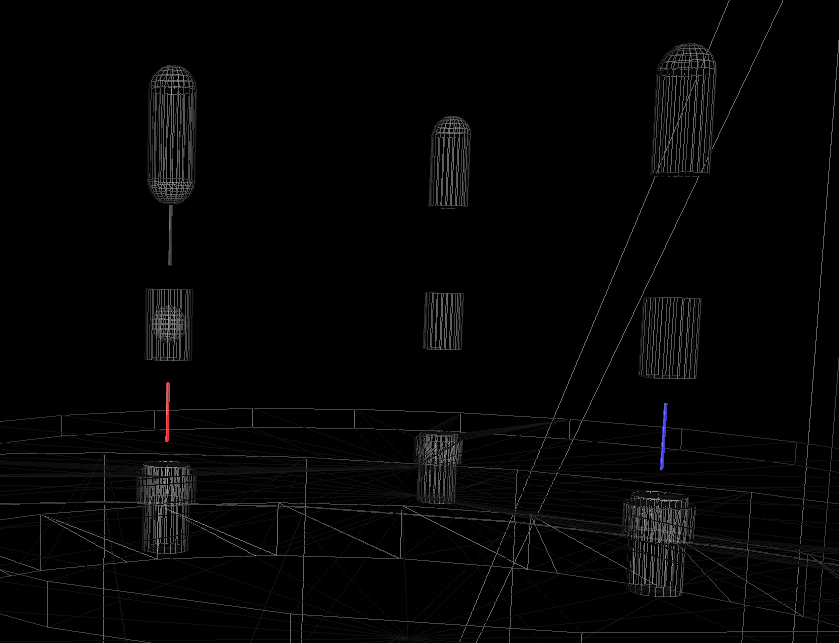
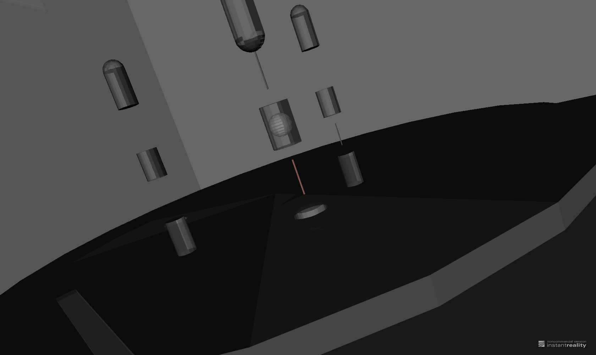

VRML2FILE export debugging
============================

.. contents:: :local:

TODO
-----

#. Does VRML2 support metadata that can be made visible, eg volume labels
#. look into position precision handling 

Observations Summary
-----------------------

#. all volumes traversed are output, contrary to initial expectation than volumes would be dropped
#. 15 volumes yield warnings, many are very thin in one or more directions, BUT several big volumes too

Examining raw export log with pv dumping
------------------------------------------

Via adding debug dumping of the pv name to the VRML2FILE exporter determine the volumes that yield BooleanProcessor warnings.

::

    [blyth@belle7 export]$ grep ^SCB exportdbg.log | head -5                              
    SCB Universe.0
    SCB /dd/Structure/Sites/db-rock.1000
    SCB /dd/Geometry/Sites/lvNearSiteRock#pvNearHallTop.1000
    SCB /dd/Geometry/Sites/lvNearHallTop#pvNearTopCover.1000
    SCB /dd/Geometry/Sites/lvNearHallTop#pvNearTeleRpc#pvNearTeleRpc:1.1

    [blyth@belle7 export]$ grep ^SCB exportdbg.log | wc -l           
    12230
    [blyth@belle7 export]$ grep ^SCB exportdbg.log | cut -d" " -f2 - | wc -l
    12230
    [blyth@belle7 export]$ grep ^SCB exportdbg.log | cut -d" " -f2 - | sort | uniq | wc -l 
    5643

    [blyth@belle7 export]$ echo "select count(*) from shape ;" | sqlite3 g4_01.db
    12229
    [blyth@belle7 export]$ echo "select count(distinct(name)) from shape ;" | sqlite3 g4_01.db
    5642

#. all volumes are output despite the warnings, except Universe.0 which got culled in my original g4_01.wrl 

Ordering Check
~~~~~~~~~~~~~~~~~~
::

    blyth@belle7 export]$ grep ^SCB exportdbg.log | head -1 | tail -1 
    SCB Universe.0

    [blyth@belle7 export]$ grep ^SCB exportdbg.log | head -2 | tail -1 
    SCB /dd/Structure/Sites/db-rock.1000

    [blyth@belle7 export]$ echo "select id, name from shape where id in (2-1) ;" | sqlite3 g4_01.db
    1|/dd/Structure/Sites/db-rock.1000

    [blyth@belle7 export]$ echo "select id, name from shape where id in (9999,10000,10001) ;" | sqlite3 g4_01.db
    9999|/dd/Geometry/PMT/lvPmtHemiVacuum#pvPmtHemiCathode.1000
    10000|/dd/Geometry/PMT/lvPmtHemiVacuum#pvPmtHemiBottom.1001
    10001|/dd/Geometry/PMT/lvPmtHemiVacuum#pvPmtHemiDynode.1002

    [blyth@belle7 export]$ grep ^SCB exportdbg.log | head -10000 | tail -1 
    SCB /dd/Geometry/PMT/lvPmtHemiVacuum#pvPmtHemiCathode.1000

#. the order matches that in the DB for that one at least

parse the log 
~~~~~~~~~~~~~

::

    [blyth@belle7 export]$ ./exportdbg.py > exportdbg.txt
    INFO:__main__:opening /home/blyth/env/geant4/geometry/export/g4_01.db 

exportdbg.txt
--------------

.. literalinclude:: exportdbg.txt

Noisy 15
------------

::

    select sid,npo,ax,ay,az,dx,dy,dz,name from xshape where sid in (2435,3149,3151,3199,4356,4447,4463,4539,4540,4542,4550,4551,4565,4566,4605) ; 
    sid         npo         ax                 ay          az          dx          dy          dz          name                                                                 
    ----------  ----------  -----------------  ----------  ----------  ----------  ----------  ----------  ---------------------------------------------------------------------
    2435        24          -20103.8666666667  -796552.0   -1583.37    9892.5      6398.0      294.4       /dd/Geometry/RPCSupport/lvNearHbeamBigUnit#pvNearRightSpanHbeam2.1003
    3149        50          -16048.293         -803091.86  -7067.9982  13644.59    15422.0     9916.0      /dd/Geometry/Pool/lvNearPoolDead#pvNearPoolLiner.1000                
    3151        50          -16085.48          -802990.16  -6565.9996  11506.8     13286.0     8912.0      /dd/Geometry/Pool/lvNearPoolOWS#pvNearPoolCurtain.1000               
    3199        362         -16595.8593922652  -801442.65  -8842.5002  270.200000  286.0       200.580000  /dd/Geometry/AD/lvOIL#pvAdPmtArray#pvAdPmtArrayRotated#pvAdPmtRingInC
    4356        50          -18289.832         -800004.44  -4826.5     60.7999999  61.0        53.0        /dd/Geometry/PMT/lvHeadonPmtAssy#pvHeadonPmtBase.1001                
    4447        16          -18423.7625        -797823.37  -9355.0     1481.6      330.0       430.0       /dd/Geometry/AD/lvOIL#pvSstBotCirRib#SstBotCirRib:7.7                
    4463        22          -17784.9136363636  -798325.59  -4814.5577  553.700000  2147.0      258.730000  /dd/Geometry/AD/lvOIL#pvSstTopTshapeRibs#SstTopTshapeRibs:7#SstTopTsh

    4539        203         -18014.5467980295  -799605.36  -4226.9387  525.299999  525.0       12.6999999  /dd/Geometry/CalibrationBox/lvDomeInterior#pvTurntableLowerPlate.1002
    4540        629         -18079.3666136725  -799699.33  -4117.2252  20.0999999  20.0        204.61      /dd/Geometry/CalibrationBox/lvDomeInterior#pvLedSourceAssyInAcu.1003 
    4542        267         -18079.4528089888  -799699.44  -4157.1200  15.9000000  15.0        15.8800000  /dd/Geometry/CalibrationSources/lvLedSourceShell#pvDiffuserBall.1000 
    4550        50          -18079.46          -799699.44  -4194.7200  0.59999999  1.0         25.3999999  /dd/Geometry/CalibrationSources/lvLedSourceAssy#pvLedWeightCableBot.1

    4551        357         -17900.4431372549  -799614.67  -4125.3917  20.0        20.0        204.61      /dd/Geometry/CalibrationBox/lvDomeInterior#pvGe68SourceAssyInAcu.1004
    4565        50          -17900.608         -799614.56  -4194.7200  0.60000000  1.0         25.3999999  /dd/Geometry/CalibrationSources/lvGe68SourceAssy#pvWeightCableBot.100
    4566        296         -18063.5753378378  -799502.09  -4106.4188  20.0        20.0        204.61      /dd/Geometry/CalibrationBox/lvDomeInterior#pvAmCCo60SourceAssyInAcu.1
    4605        172         -18056.4389534884  -799666.11  -4389.4031  1845.7      1845.0      299.99      /dd/Geometry/OverflowTanks/lvOflTnkContainer#pvOflTnkCnrSpace.1000   

4550 + 4565 are cables
~~~~~~~~~~~~~~~~~~~~~~~

::

   simon:~ blyth$ eai-edit -emissiveColor 1,0,0 4550
   simon:~ blyth$ eai-edit -emissiveColor 0,0,1 4565

scene for the noisy ones
~~~~~~~~~~~~~~~~~~~~~~~~~~

::

    [blyth@belle7 export]$ shapedb.py -c 2435 3149 3151 3199 4356 4447 4463 4539 4540 4542 4550 4551 4565 4566 4605 > $(nginx-htdocs)/wrl/booleans.wrl
    2013-09-19 13:03:12,090 env.geant4.geometry.export.shapecnf INFO     /home/blyth/env/bin/shapedb.py -c 2435 3149 3151 3199 4356 4447 4463 4539 4540 4542 4550 4551 4565 4566 4605
    2013-09-19 13:03:12,090 env.geant4.geometry.export.shapedb INFO     opening /usr/lib/python2.4/site-packages/env/geant4/geometry/export/g4_01.db 
    2013-09-19 13:03:12,091 env.geant4.geometry.export.shapedb INFO     Operate on 15 shapes, selected by args : [2435, 3149, 3151, 3199, 4356, 4447, 4463, 4539, 4540, 4542, 4550, 4551, 4565, 4566, 4605] 
    2013-09-19 13:03:12,120 env.geant4.geometry.export.shapedb INFO     opts.center selected, will translate all 15 shapes such that centroid of all is at origin, original coordinate centroid at (-17781.177193995383, -799979.21555042337, -4941.5240993071557) 
    2013-09-19 13:03:12,120 env.geant4.geometry.export.shapedb INFO     #        sid        npo          ax          ay          az          dx          dy          dz 
    2013-09-19 13:03:12,125 env.geant4.geometry.export.shapedb INFO     #       2435         24   -20103.87  -796552.00    -1583.37     9892.50     6398.00      294.40  /dd/Geometry/RPCSupport/lvNearHbeamBigUnit#pvNearRightSpanHbeam2.1003 
    2013-09-19 13:03:12,125 env.geant4.geometry.export.shapedb INFO     #       3149         50   -16048.29  -803091.86    -7068.00    13644.59    15422.00     9916.00  /dd/Geometry/Pool/lvNearPoolDead#pvNearPoolLiner.1000 
    2013-09-19 13:03:12,125 env.geant4.geometry.export.shapedb INFO     #       3151         50   -16085.48  -802990.16    -6566.00    11506.80    13286.00     8912.00  /dd/Geometry/Pool/lvNearPoolOWS#pvNearPoolCurtain.1000 
    2013-09-19 13:03:12,127 env.geant4.geometry.export.shapedb INFO     #       3199        362   -16595.86  -801442.65    -8842.50      270.20      286.00      200.58  /dd/Geometry/AD/lvOIL#pvAdPmtArray#pvAdPmtArrayRotated#pvAdPmtRingInCyl:1#pvAdPmtInRing:1#pvAdPmtUnit#pvAdPmt.1 
    2013-09-19 13:03:12,127 env.geant4.geometry.export.shapedb INFO     #       4356         50   -18289.83  -800004.44    -4826.50       60.80       61.00       53.00  /dd/Geometry/PMT/lvHeadonPmtAssy#pvHeadonPmtBase.1001 
    2013-09-19 13:03:12,127 env.geant4.geometry.export.shapedb INFO     #       4447         16   -18423.76  -797823.38    -9355.00     1481.60      330.00      430.00  /dd/Geometry/AD/lvOIL#pvSstBotCirRib#SstBotCirRib:7.7 
    2013-09-19 13:03:12,127 env.geant4.geometry.export.shapedb INFO     #       4463         22   -17784.91  -798325.59    -4814.56      553.70     2147.00      258.73  /dd/Geometry/AD/lvOIL#pvSstTopTshapeRibs#SstTopTshapeRibs:7#SstTopTshapeRot.7 
    2013-09-19 13:03:12,127 env.geant4.geometry.export.shapedb INFO     #       4539        203   -18014.55  -799605.37    -4226.94      525.30      525.00       12.70  /dd/Geometry/CalibrationBox/lvDomeInterior#pvTurntableLowerPlate.1002 
    2013-09-19 13:03:12,128 env.geant4.geometry.export.shapedb INFO     #       4540        629   -18079.37  -799699.34    -4117.23       20.10       20.00      204.61  /dd/Geometry/CalibrationBox/lvDomeInterior#pvLedSourceAssyInAcu.1003 
    2013-09-19 13:03:12,128 env.geant4.geometry.export.shapedb INFO     #       4542        267   -18079.45  -799699.45    -4157.12       15.90       15.00       15.88  /dd/Geometry/CalibrationSources/lvLedSourceShell#pvDiffuserBall.1000 
    2013-09-19 13:03:12,128 env.geant4.geometry.export.shapedb INFO     #       4550         50   -18079.46  -799699.44    -4194.72        0.60        1.00       25.40  /dd/Geometry/CalibrationSources/lvLedSourceAssy#pvLedWeightCableBot.1004 
    2013-09-19 13:03:12,128 env.geant4.geometry.export.shapedb INFO     #       4551        357   -17900.44  -799614.67    -4125.39       20.00       20.00      204.61  /dd/Geometry/CalibrationBox/lvDomeInterior#pvGe68SourceAssyInAcu.1004 
    2013-09-19 13:03:12,128 env.geant4.geometry.export.shapedb INFO     #       4565         50   -17900.61  -799614.56    -4194.72        0.60        1.00       25.40  /dd/Geometry/CalibrationSources/lvGe68SourceAssy#pvWeightCableBot.1004 
    2013-09-19 13:03:12,128 env.geant4.geometry.export.shapedb INFO     #       4566        296   -18063.58  -799502.10    -4106.42       20.00       20.00      204.61  /dd/Geometry/CalibrationBox/lvDomeInterior#pvAmCCo60SourceAssyInAcu.1005 
    2013-09-19 13:03:12,140 env.geant4.geometry.export.shapedb INFO     #       4605        172   -18056.44  -799666.11    -4389.40     1845.70     1845.00      299.99  /dd/Geometry/OverflowTanks/lvOflTnkContainer#pvOflTnkCnrSpace.1000 
    2013-09-19 13:03:12,140 env.geant4.geometry.export.shapedb INFO     select src_head||x'0A'||group_concat(x'09'||x'09'||x'09'||x'09'||x'09'||(1*(x-(-17781.177194)))||' '||(1*(y-(-799979.21555)))||' '||(1*(z-(-4941.52409931)))||',',x'0A')||x'0A'||src_tail from point join shape on shape.id = point.sid where sid in (2435,3149,3151,3199,4356,4447,4463,4539,4540,4542,4550,4551,4565,4566,4605) group by sid ;
    [blyth@belle7 export]$ 

noisy 15 with 4550 highlighted
~~~~~~~~~~~~~~~~~~~~~~~~~~~~~~~~~

::

    [blyth@belle7 export]$ shapedb.py -c 2435 3149 3151 3199 4356 4447 4463 4539 4540 4542 4550 4551 4565 4566 4605 > $(nginx-htdocs)/wrl/booleans.wrl
    simon:geometry blyth$ eai-edit -emissiveColor 1,0,0 4550

4550 detdesc
~~~~~~~~~~~~~~

NuWa-trunk/dybgaudi/Detector/XmlDetDesc/DDDB/CalibrationSources/parameters.xml::

     91 <parameter name="WeightLength" value="4.755*cm"/>
     92 <parameter name="WeightAcrylicLength" value="5.702*cm"/>
     93 <parameter name="WeightRadius" value="6.35*mm"/>
     94 <parameter name="WeightAcrylicRadius" value="1.0035*cm"/>
     95 <parameter name="WeightCableLength" value="2.54*cm"/>
     96 <parameter name="WeightCableLengthInAcr" 
     97        value="0.5*(WeightAcrylicLength-WeightLength)"/>
     98 <parameter name="WeightCableRadius" value="0.3*mm"/>

NuWa-trunk/dybgaudi/Detector/XmlDetDesc/DDDB/CalibrationSources/sources.xml::

    067  <logvol name="lvWeightCable" material="StainlessSteel">
    068    <tubs name="WeightCable" sizeZ="WeightCableLength" 
    069      outerRadius="WeightCableRadius" />
    070  </logvol>
    ...
    108 <!-- The LED diffuser ball source assembly with weights -->
    109  <logvol name="lvLedSourceAssy" material="Vacuum">
    110    <union name="led-source-assy">
    111      <tubs name="led-cylinder"
    112            sizeZ="LedSourceAcrylicHeight-2*LedSourceAcrylicRadius"
    113            outerRadius="LedSourceAcrylicRadius"/>
    ...
    151      <sphere name="led-weighthemi2bot"
    152            deltaThetaAngle="90*degree"
    153            outerRadius="WeightAcrylicRadius"/>
    154      <posXYZ z="-0.5*(WeightAcrylicLength-2*WeightAcrylicRadius)-(0.5*LedSourceAcrylicHeight+WeightCableLength+0.5*WeightAcrylicLength)"/>
    155      <rotXYZ rotX="180*degree" rotY="180*degree"/>
    156      <tubs name="led-weightcablebot"
    157            sizeZ="WeightCableLength"
    158            outerRadius="WeightCableRadius"/>
    159      <posXYZ z="-0.5*LedSourceAcrylicHeight-0.5*WeightCableLength"/>
    160      <rotXYZ rotY="180*degree" />
    161    </union>
    162 
    163 
    164    <physvol name="pvLedSourceShell" 
    165             logvol="/dd/Geometry/CalibrationSources/lvLedSourceShell" />
    166 
    167    <physvol name="pvLedWeightShellTop" 
    168             logvol="/dd/Geometry/CalibrationSources/lvWeightShell">
    169      <posXYZ z="0.5*LedSourceAcrylicHeight+WeightCableLength+0.5*WeightAcrylicLength"/>
    170    </physvol>
    171 
    172    <physvol name="pvLedWeightCableTop" 
    173             logvol="/dd/Geometry/CalibrationSources/lvWeightCable">
    174      <posXYZ z="0.5*LedSourceAcrylicHeight+0.5*WeightCableLength"/>
    175    </physvol>
    176 
    177    <physvol name="pvLedWeightShellBot" 
    178             logvol="/dd/Geometry/CalibrationSources/lvWeightShell">
    179      <posXYZ z="-(0.5*LedSourceAcrylicHeight+WeightCableLength+0.5*WeightAcrylicLength)"/>
    180      <rotXYZ rotY="180*degree" />
    181    </physvol>
    182 
    183    <physvol name="pvLedWeightCableBot" 
    184             logvol="/dd/Geometry/CalibrationSources/lvWeightCable">
    185       <posXYZ z="-0.5*LedSourceAcrylicHeight-0.5*WeightCableLength"/>
    186    </physvol>
    187 
    188  </logvol>

4550 at the point level
~~~~~~~~~~~~~~~~~~~~~~~

::

    4550
    /dd/Geometry/CalibrationSources/lvLedSourceAssy#pvLedWeightCableBot.1004
    BooleanProcessor::caseIE : unimplemented case
    BooleanProcessor::caseIE : unimplemented case
    BooleanProcessor::caseIE : unimplemented case
    BooleanProcessor::caseIE : unimplemented case
    BooleanProcessor: boolean operation failed
    BooleanProcessor::caseIE : unimplemented case
    BooleanProcessor::caseIE : unimplemented case
    BooleanProcessor::caseIE : unimplemented case
    BooleanProcessor::caseIE : unimplemented case
    BooleanProcessor: boolean operation failed
    BooleanProcessor::execute : unknown faces !!! 
    BooleanProcessor: boolean operation failed
    BooleanProcessor::execute : unknown faces !!! 
    BooleanProcessor: boolean operation failed
    BooleanProcessor::triangulateFace : too small contour
    BooleanProcessor::triangulateContour : could not generate a triangle (infinite loop)
    BooleanProcessor: boolean operation failed
    BooleanProcessor::execute : unknown faces !!! 
    BooleanProcessor: boolean operation failed
    select sid,npo,ax,ay,az,dx,dy,dz,name from xshape where sid in (4550) ; 
    sid         npo         ax          ay          az                 dx                 dy          dz                name    
    ----------  ----------  ----------  ----------  -----------------  -----------------  ----------  ----------------  ------------------------------------------------------------------------
    4550        50          -18079.46   -799699.44  -4194.72000000001  0.599999999998545  1.0         25.3999999999996  /dd/Geometry/CalibrationSources/lvLedSourceAssy#pvLedWeightCableBot.1004

Many duplicated points, looks like a precision issue::

    #---------- SOLID: /dd/Geometry/CalibrationSources/lvLedSourceAssy#pvLedWeightCableBot.1004
            Shape {
                    appearance Appearance {
                            material Material {
                                    diffuseColor 1 1 1
                                    transparency 0.7
                            }
                    }
                    geometry IndexedFaceSet {
                            coord Coordinate {
                                    point [
                                            -18079.6 -799700 -4182.02,
                                            -18079.6 -799700 -4182.02,
                                            -18079.5 -799700 -4182.02,
                                            -18079.4 -799700 -4182.02,
                                            -18079.3 -799700 -4182.02,
                                            -18079.3 -799700 -4182.02,
                                            -18079.2 -799700 -4182.02,
                                            -18079.2 -799700 -4182.02,
                                            -18079.2 -799699 -4182.02,

