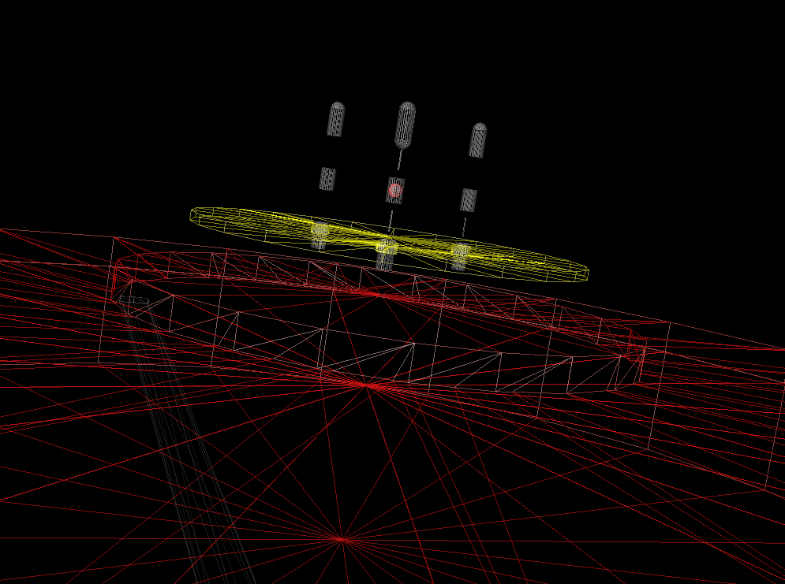
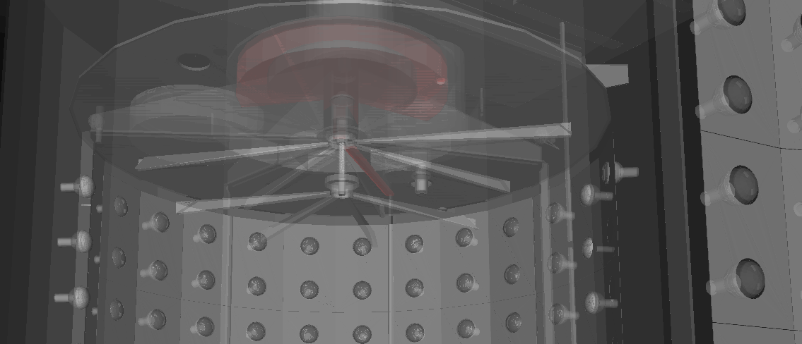

VRML2FILE export debugging
============================

.. contents:: :local:

TODO
-----

#. Does VRML2 support metadata that can be made visible, eg volume labels
#. look into position precision handling 

Observations Summary
-----------------------

#. all volumes traversed are output, contrary to initial expectation than volumes would be dropped
#. 15 volumes yield warnings, many are very thin in one or more directions, BUT several big volumes too

Examining raw export log with pv dumping
------------------------------------------

Via adding debug dumping of the pv name to the VRML2FILE exporter determine the volumes that yield BooleanProcessor warnings.

::

    [blyth@belle7 export]$ grep ^SCB exportdbg.log | head -5                              
    SCB Universe.0
    SCB /dd/Structure/Sites/db-rock.1000
    SCB /dd/Geometry/Sites/lvNearSiteRock#pvNearHallTop.1000
    SCB /dd/Geometry/Sites/lvNearHallTop#pvNearTopCover.1000
    SCB /dd/Geometry/Sites/lvNearHallTop#pvNearTeleRpc#pvNearTeleRpc:1.1

    [blyth@belle7 export]$ grep ^SCB exportdbg.log | wc -l           
    12230
    [blyth@belle7 export]$ grep ^SCB exportdbg.log | cut -d" " -f2 - | wc -l
    12230
    [blyth@belle7 export]$ grep ^SCB exportdbg.log | cut -d" " -f2 - | sort | uniq | wc -l 
    5643

    [blyth@belle7 export]$ echo "select count(*) from shape ;" | sqlite3 g4_01.db
    12229
    [blyth@belle7 export]$ echo "select count(distinct(name)) from shape ;" | sqlite3 g4_01.db
    5642

#. all volumes are output despite the warnings, except Universe.0 which got culled in my original g4_01.wrl 

Ordering Check
~~~~~~~~~~~~~~~~~~
::

    blyth@belle7 export]$ grep ^SCB exportdbg.log | head -1 | tail -1 
    SCB Universe.0

    [blyth@belle7 export]$ grep ^SCB exportdbg.log | head -2 | tail -1 
    SCB /dd/Structure/Sites/db-rock.1000

    [blyth@belle7 export]$ echo "select id, name from shape where id in (2-1) ;" | sqlite3 g4_01.db
    1|/dd/Structure/Sites/db-rock.1000

    [blyth@belle7 export]$ echo "select id, name from shape where id in (9999,10000,10001) ;" | sqlite3 g4_01.db
    9999|/dd/Geometry/PMT/lvPmtHemiVacuum#pvPmtHemiCathode.1000
    10000|/dd/Geometry/PMT/lvPmtHemiVacuum#pvPmtHemiBottom.1001
    10001|/dd/Geometry/PMT/lvPmtHemiVacuum#pvPmtHemiDynode.1002

    [blyth@belle7 export]$ grep ^SCB exportdbg.log | head -10000 | tail -1 
    SCB /dd/Geometry/PMT/lvPmtHemiVacuum#pvPmtHemiCathode.1000

#. the order matches that in the DB for that one at least

parse the log 
~~~~~~~~~~~~~

::

    [blyth@belle7 export]$ ./exportdbg.py > exportdbg.txt
    INFO:__main__:opening /home/blyth/env/geant4/geometry/export/g4_01.db 

exportdbg.txt
--------------

.. literalinclude:: exportdbg.txt

Noisy 15
------------

::

    select sid,npo,ax,ay,az,dx,dy,dz,name from xshape where sid in (2435,3149,3151,3199,4356,4447,4463,4539,4540,4542,4550,4551,4565,4566,4605) ; 
    sid         npo         ax                 ay          az          dx          dy          dz          name                                                                 
    ----------  ----------  -----------------  ----------  ----------  ----------  ----------  ----------  ---------------------------------------------------------------------
    2435        24          -20103.8666666667  -796552.0   -1583.37    9892.5      6398.0      294.4       /dd/Geometry/RPCSupport/lvNearHbeamBigUnit#pvNearRightSpanHbeam2.1003
    3149        50          -16048.293         -803091.86  -7067.9982  13644.59    15422.0     9916.0      /dd/Geometry/Pool/lvNearPoolDead#pvNearPoolLiner.1000                
    3151        50          -16085.48          -802990.16  -6565.9996  11506.8     13286.0     8912.0      /dd/Geometry/Pool/lvNearPoolOWS#pvNearPoolCurtain.1000               
    3199        362         -16595.8593922652  -801442.65  -8842.5002  270.200000  286.0       200.580000  /dd/Geometry/AD/lvOIL#pvAdPmtArray#pvAdPmtArrayRotated#pvAdPmtRingInC
    4447        16          -18423.7625        -797823.37  -9355.0     1481.6      330.0       430.0       /dd/Geometry/AD/lvOIL#pvSstBotCirRib#SstBotCirRib:7.7                

    4356        50          -18289.832         -800004.44  -4826.5     60.7999999  61.0        53.0        /dd/Geometry/PMT/lvHeadonPmtAssy#pvHeadonPmtBase.1001                
    4463        22          -17784.9136363636  -798325.59  -4814.5577  553.700000  2147.0      258.730000  /dd/Geometry/AD/lvOIL#pvSstTopTshapeRibs#SstTopTshapeRibs:7#SstTopTsh

    4539        203         -18014.5467980295  -799605.36  -4226.9387  525.299999  525.0       12.6999999  /dd/Geometry/CalibrationBox/lvDomeInterior#pvTurntableLowerPlate.1002
    4542        267         -18079.4528089888  -799699.44  -4157.1200  15.9000000  15.0        15.8800000  /dd/Geometry/CalibrationSources/lvLedSourceShell#pvDiffuserBall.1000 

    4566        296         -18063.5753378378  -799502.09  -4106.4188  20.0        20.0        204.61      /dd/Geometry/CalibrationBox/lvDomeInterior#pvAmCCo60SourceAssyInAcu.1
    4540        629         -18079.3666136725  -799699.33  -4117.2252  20.0999999  20.0        204.61      /dd/Geometry/CalibrationBox/lvDomeInterior#pvLedSourceAssyInAcu.1003 
    4550        50          -18079.46          -799699.44  -4194.7200  0.59999999  1.0         25.3999999  /dd/Geometry/CalibrationSources/lvLedSourceAssy#pvLedWeightCableBot.1
    4551        357         -17900.4431372549  -799614.67  -4125.3917  20.0        20.0        204.61      /dd/Geometry/CalibrationBox/lvDomeInterior#pvGe68SourceAssyInAcu.1004
    4565        50          -17900.608         -799614.56  -4194.7200  0.60000000  1.0         25.3999999  /dd/Geometry/CalibrationSources/lvGe68SourceAssy#pvWeightCableBot.100

    4605        172         -18056.4389534884  -799666.11  -4389.4031  1845.7      1845.0      299.99      /dd/Geometry/OverflowTanks/lvOflTnkContainer#pvOflTnkCnrSpace.1000   

Skip the big 3 + lowZ 2
~~~~~~~~~~~~~~~~~~~~~~~~~~~~~

::

    [blyth@belle7 export]$ shapedb.py -e 4000 -c --  -4356 -4463 -4539 -4540 -4542 -4550 -4551 -4565 -4566 -4605 > $(nginx-htdocs)/wrl/abooleans.wrl
    2013-09-19 18:19:12,686 env.geant4.geometry.export.shapecnf INFO     /home/blyth/env/bin/shapedb.py -e 4000 -c -- -4356 -4463 -4539 -4540 -4542 -4550 -4551 -4565 -4566 -4605
    2013-09-19 18:19:12,687 env.geant4.geometry.export.shapedb INFO     opening /usr/lib/python2.4/site-packages/env/geant4/geometry/export/g4_01.db 
    2013-09-19 18:19:12,687 env.geant4.geometry.export.shapedb INFO     Operate on 10 shapes [negated 10], selected by args : ['-4356', '-4463', '-4539', '-4540', '-4542', '-4550', '-4551', '-4565', '-4566', '-4605'] 
    2013-09-19 18:19:12,713 env.geant4.geometry.export.shapedb INFO     opts.center selected, will translate all 10 shapes such that centroid of all is at origin, original coordinate centroid at (-18036.181106870226, -799636.08730916027, -4183.0695324427443) 
    2013-09-19 18:19:12,713 env.geant4.geometry.export.shapedb INFO     presence of negated ids signals split print, negated ids will be annotated (useful for small volumes, not so good with big ones as interferes with navigation)

    2013-09-19 18:19:12,713 env.geant4.geometry.export.shapedb INFO     #        sid        npo          ax          ay          az          dx          dy          dz 

    # three complicated union source assemblies
    2013-09-19 18:19:12,724 env.geant4.geometry.export.shapedb INFO     #       4540        629   -18079.37  -799699.34    -4117.23       20.10       20.00      204.61  /dd/Geometry/CalibrationBox/lvDomeInterior#pvLedSourceAssyInAcu.1003 
    2013-09-19 18:19:12,725 env.geant4.geometry.export.shapedb INFO     #       4566        296   -18063.58  -799502.10    -4106.42       20.00       20.00      204.61  /dd/Geometry/CalibrationBox/lvDomeInterior#pvAmCCo60SourceAssyInAcu.1005 
    2013-09-19 18:19:12,724 env.geant4.geometry.export.shapedb INFO     #       4551        357   -17900.44  -799614.67    -4125.39       20.00       20.00      204.61  /dd/Geometry/CalibrationBox/lvDomeInterior#pvGe68SourceAssyInAcu.1004 
    # all three assemblies poke thru this plate : yellow | eai-edit -emissiveColor 1,1,0 4539
    2013-09-19 18:19:12,723 env.geant4.geometry.export.shapedb INFO     #       4539        203   -18014.55  -799605.37    -4226.94      525.30      525.00       12.70  /dd/Geometry/CalibrationBox/lvDomeInterior#pvTurntableLowerPlate.1002 
    
    # ball inside 4540 : red : eai-edit -emissiveColor 1,0,0 4542 
    2013-09-19 18:19:12,724 env.geant4.geometry.export.shapedb INFO     #       4542        267   -18079.45  -799699.45    -4157.12       15.90       15.00       15.88  /dd/Geometry/CalibrationSources/lvLedSourceShell#pvDiffuserBall.1000 

    # cables lines up with assemblies
    2013-09-19 18:19:12,724 env.geant4.geometry.export.shapedb INFO     #       4550         50   -18079.46  -799699.44    -4194.72        0.60        1.00       25.40  /dd/Geometry/CalibrationSources/lvLedSourceAssy#pvLedWeightCableBot.1004 
    2013-09-19 18:19:12,725 env.geant4.geometry.export.shapedb INFO     #       4565         50   -17900.61  -799614.56    -4194.72        0.60        1.00       25.40  /dd/Geometry/CalibrationSources/lvGe68SourceAssy#pvWeightCableBot.1004 

    # union of tubs? : red : eai-edit -emissiveColor 1,0,0 4605    
    2013-09-19 18:19:12,736 env.geant4.geometry.export.shapedb INFO     #       4605        172   -18056.44  -799666.11    -4389.40     1845.70     1845.00      299.99  /dd/Geometry/OverflowTanks/lvOflTnkContainer#pvOflTnkCnrSpace.1000 

    # small low tubs  
    2013-09-19 18:19:12,723 env.geant4.geometry.export.shapedb INFO     #       4356         50   -18289.83  -800004.44    -4826.50       60.80       61.00       53.00  /dd/Geometry/PMT/lvHeadonPmtAssy#pvHeadonPmtBase.1001 

    # long beam
    2013-09-19 18:19:12,723 env.geant4.geometry.export.shapedb INFO     #       4463         22   -17784.91  -798325.59    -4814.56      553.70     2147.00      258.73  /dd/Geometry/AD/lvOIL#pvSstTopTshapeRibs#SstTopTshapeRibs:7#SstTopTshapeRot.7 

4539 subtraction tubs with holes
~~~~~~~~~~~~~~~~~~~~~~~~~~~~~~~~~

::

    [blyth@cms01 DDDB]$ find . -name '*.xml' -exec grep -H pvTurntableLowerPlate {} \;
    ./CalibrationBox/calib-box.xml:  <physvol name="pvTurntableLowerPlate" logvol="/dd/Geometry/CalibrationBox/lvTurntable">

::

    192  <!-- Dome Interior -->
    193  <logvol name="lvDomeInterior" material="Nitrogen">
    194   <tubs name="DomeInterior" sizeZ="CalibrationDomeTotalHeight-CalibrationDomeWallThickness" outerRadius="CalibrationDomeRadius-CalibrationDomeWallThickness" />
    195   
    196   <physvol name="pvShieldingPuck" logvol="/dd/Geometry/CalibrationBox/lvShieldingPuck">
    197   <posRPhiZ r="CalibPortOffsetR" phi="NeutronShieldCylinderPhi" 
    198         z="ShieldingPuckZ" />
    199   </physvol>
    200   
    201  
    202   <physvol name="pvBearingRing" logvol="/dd/Geometry/CalibrationBox/lvBearingRing">
    203   <posXYZ x="0*cm" y="0*cm" z="BearingRingZ" />
    204   </physvol>
    205  
    206   <physvol name="pvTurntableLowerPlate" logvol="/dd/Geometry/CalibrationBox/lvTurntable">
    207   <posXYZ x="0*cm" y="0*cm" z="TurntableLowerPlateZ" />
    208   </physvol>
    209  
    ...
    265  <!-- Turntable -->
    266  <logvol name="lvTurntable" material="StainlessSteel">
    267    <subtraction name="turntable">
    268      <tubs name="Turntable" 
    269            sizeZ="TurntablePlateThickness" 
    270            outerRadius="TurntableRadius" />
    271      <tubs name="LedTurntableHole" 
    272            sizeZ="TurntablePlateThickness" 
    273            outerRadius="TurntableHoleRadius" />
    274      <posRPhiZ r="CalibPortOffsetR" phi="LEDSourcePhi" 
    275            z="0*cm" />
    276      <tubs name="Ge68TurntableHole" 
    277            sizeZ="TurntablePlateThickness" 
    278            outerRadius="TurntableHoleRadius" />
    279      <posRPhiZ r="CalibPortOffsetR" phi="GammaShieldCylinderPhi" 
    280            z="0*cm" />
    281      <tubs name="AmCTurntableHole" 
    282            sizeZ="TurntablePlateThickness" 
    283            outerRadius="TurntableHoleRadius" />
    284      <posRPhiZ r="CalibPortOffsetR" phi="NeutronShieldCylinderPhi" 
    285            z="0*cm" />
    286    </subtraction>
    287  </logvol>

4550 + 4565 are cables
~~~~~~~~~~~~~~~~~~~~~~~

.. image:: cables.png

scene for the noisy ones
~~~~~~~~~~~~~~~~~~~~~~~~~~

::

    [blyth@belle7 export]$ shapedb.py -c 2435 3149 3151 3199 4356 4447 4463 4539 4540 4542 4550 4551 4565 4566 4605 > $(nginx-htdocs)/wrl/booleans.wrl
    2013-09-19 13:03:12,090 env.geant4.geometry.export.shapecnf INFO     /home/blyth/env/bin/shapedb.py -c 2435 3149 3151 3199 4356 4447 4463 4539 4540 4542 4550 4551 4565 4566 4605
    2013-09-19 13:03:12,090 env.geant4.geometry.export.shapedb INFO     opening /usr/lib/python2.4/site-packages/env/geant4/geometry/export/g4_01.db 
    2013-09-19 13:03:12,091 env.geant4.geometry.export.shapedb INFO     Operate on 15 shapes, selected by args : [2435, 3149, 3151, 3199, 4356, 4447, 4463, 4539, 4540, 4542, 4550, 4551, 4565, 4566, 4605] 
    2013-09-19 13:03:12,120 env.geant4.geometry.export.shapedb INFO     opts.center selected, will translate all 15 shapes such that centroid of all is at origin, original coordinate centroid at (-17781.177193995383, -799979.21555042337, -4941.5240993071557) 
    2013-09-19 13:03:12,120 env.geant4.geometry.export.shapedb INFO     #        sid        npo          ax          ay          az          dx          dy          dz 
    2013-09-19 13:03:12,125 env.geant4.geometry.export.shapedb INFO     #       2435         24   -20103.87  -796552.00    -1583.37     9892.50     6398.00      294.40  /dd/Geometry/RPCSupport/lvNearHbeamBigUnit#pvNearRightSpanHbeam2.1003 
    2013-09-19 13:03:12,125 env.geant4.geometry.export.shapedb INFO     #       3149         50   -16048.29  -803091.86    -7068.00    13644.59    15422.00     9916.00  /dd/Geometry/Pool/lvNearPoolDead#pvNearPoolLiner.1000 
    2013-09-19 13:03:12,125 env.geant4.geometry.export.shapedb INFO     #       3151         50   -16085.48  -802990.16    -6566.00    11506.80    13286.00     8912.00  /dd/Geometry/Pool/lvNearPoolOWS#pvNearPoolCurtain.1000 
    2013-09-19 13:03:12,127 env.geant4.geometry.export.shapedb INFO     #       3199        362   -16595.86  -801442.65    -8842.50      270.20      286.00      200.58  /dd/Geometry/AD/lvOIL#pvAdPmtArray#pvAdPmtArrayRotated#pvAdPmtRingInCyl:1#pvAdPmtInRing:1#pvAdPmtUnit#pvAdPmt.1 
    2013-09-19 13:03:12,127 env.geant4.geometry.export.shapedb INFO     #       4356         50   -18289.83  -800004.44    -4826.50       60.80       61.00       53.00  /dd/Geometry/PMT/lvHeadonPmtAssy#pvHeadonPmtBase.1001 
    2013-09-19 13:03:12,127 env.geant4.geometry.export.shapedb INFO     #       4447         16   -18423.76  -797823.38    -9355.00     1481.60      330.00      430.00  /dd/Geometry/AD/lvOIL#pvSstBotCirRib#SstBotCirRib:7.7 
    2013-09-19 13:03:12,127 env.geant4.geometry.export.shapedb INFO     #       4463         22   -17784.91  -798325.59    -4814.56      553.70     2147.00      258.73  /dd/Geometry/AD/lvOIL#pvSstTopTshapeRibs#SstTopTshapeRibs:7#SstTopTshapeRot.7 
    2013-09-19 13:03:12,127 env.geant4.geometry.export.shapedb INFO     #       4539        203   -18014.55  -799605.37    -4226.94      525.30      525.00       12.70  /dd/Geometry/CalibrationBox/lvDomeInterior#pvTurntableLowerPlate.1002 
    2013-09-19 13:03:12,128 env.geant4.geometry.export.shapedb INFO     #       4540        629   -18079.37  -799699.34    -4117.23       20.10       20.00      204.61  /dd/Geometry/CalibrationBox/lvDomeInterior#pvLedSourceAssyInAcu.1003 
    2013-09-19 13:03:12,128 env.geant4.geometry.export.shapedb INFO     #       4542        267   -18079.45  -799699.45    -4157.12       15.90       15.00       15.88  /dd/Geometry/CalibrationSources/lvLedSourceShell#pvDiffuserBall.1000 
    2013-09-19 13:03:12,128 env.geant4.geometry.export.shapedb INFO     #       4550         50   -18079.46  -799699.44    -4194.72        0.60        1.00       25.40  /dd/Geometry/CalibrationSources/lvLedSourceAssy#pvLedWeightCableBot.1004 
    2013-09-19 13:03:12,128 env.geant4.geometry.export.shapedb INFO     #       4551        357   -17900.44  -799614.67    -4125.39       20.00       20.00      204.61  /dd/Geometry/CalibrationBox/lvDomeInterior#pvGe68SourceAssyInAcu.1004 
    2013-09-19 13:03:12,128 env.geant4.geometry.export.shapedb INFO     #       4565         50   -17900.61  -799614.56    -4194.72        0.60        1.00       25.40  /dd/Geometry/CalibrationSources/lvGe68SourceAssy#pvWeightCableBot.1004 
    2013-09-19 13:03:12,128 env.geant4.geometry.export.shapedb INFO     #       4566        296   -18063.58  -799502.10    -4106.42       20.00       20.00      204.61  /dd/Geometry/CalibrationBox/lvDomeInterior#pvAmCCo60SourceAssyInAcu.1005 
    2013-09-19 13:03:12,140 env.geant4.geometry.export.shapedb INFO     #       4605        172   -18056.44  -799666.11    -4389.40     1845.70     1845.00      299.99  /dd/Geometry/OverflowTanks/lvOflTnkContainer#pvOflTnkCnrSpace.1000 
    2013-09-19 13:03:12,140 env.geant4.geometry.export.shapedb INFO     select src_head||x'0A'||group_concat(x'09'||x'09'||x'09'||x'09'||x'09'||(1*(x-(-17781.177194)))||' '||(1*(y-(-799979.21555)))||' '||(1*(z-(-4941.52409931)))||',',x'0A')||x'0A'||src_tail from point join shape on shape.id = point.sid where sid in (2435,3149,3151,3199,4356,4447,4463,4539,4540,4542,4550,4551,4565,4566,4605) group by sid ;

noisy 15 with 4550 highlighted
~~~~~~~~~~~~~~~~~~~~~~~~~~~~~~~~~

::

    [blyth@belle7 export]$ shapedb.py -c 2435 3149 3151 3199 4356 4447 4463 4539 4540 4542 4550 4551 4565 4566 4605 > $(nginx-htdocs)/wrl/booleans.wrl
    simon:geometry blyth$ eai-edit -emissiveColor 1,0,0 4550

.. image:: booleans_4550.png

4550 detdesc
~~~~~~~~~~~~~~

NuWa-trunk/dybgaudi/Detector/XmlDetDesc/DDDB/CalibrationSources/parameters.xml::

     91 <parameter name="WeightLength" value="4.755*cm"/>
     92 <parameter name="WeightAcrylicLength" value="5.702*cm"/>
     93 <parameter name="WeightRadius" value="6.35*mm"/>
     94 <parameter name="WeightAcrylicRadius" value="1.0035*cm"/>
     95 <parameter name="WeightCableLength" value="2.54*cm"/>
     96 <parameter name="WeightCableLengthInAcr" 
     97        value="0.5*(WeightAcrylicLength-WeightLength)"/>
     98 <parameter name="WeightCableRadius" value="0.3*mm"/>

NuWa-trunk/dybgaudi/Detector/XmlDetDesc/DDDB/CalibrationSources/sources.xml::

    067  <logvol name="lvWeightCable" material="StainlessSteel">
    068    <tubs name="WeightCable" sizeZ="WeightCableLength" 
    069      outerRadius="WeightCableRadius" />
    070  </logvol>
    ...
    108 <!-- The LED diffuser ball source assembly with weights -->
    109  <logvol name="lvLedSourceAssy" material="Vacuum">
    110    <union name="led-source-assy">
    111      <tubs name="led-cylinder"
    112            sizeZ="LedSourceAcrylicHeight-2*LedSourceAcrylicRadius"
    113            outerRadius="LedSourceAcrylicRadius"/>
    ...
    151      <sphere name="led-weighthemi2bot"
    152            deltaThetaAngle="90*degree"
    153            outerRadius="WeightAcrylicRadius"/>
    154      <posXYZ z="-0.5*(WeightAcrylicLength-2*WeightAcrylicRadius)-(0.5*LedSourceAcrylicHeight+WeightCableLength+0.5*WeightAcrylicLength)"/>
    155      <rotXYZ rotX="180*degree" rotY="180*degree"/>
    156      <tubs name="led-weightcablebot"
    157            sizeZ="WeightCableLength"
    158            outerRadius="WeightCableRadius"/>
    159      <posXYZ z="-0.5*LedSourceAcrylicHeight-0.5*WeightCableLength"/>
    160      <rotXYZ rotY="180*degree" />
    161    </union>
    162 
    163 
    164    <physvol name="pvLedSourceShell" 
    165             logvol="/dd/Geometry/CalibrationSources/lvLedSourceShell" />
    166 
    167    <physvol name="pvLedWeightShellTop" 
    168             logvol="/dd/Geometry/CalibrationSources/lvWeightShell">
    169      <posXYZ z="0.5*LedSourceAcrylicHeight+WeightCableLength+0.5*WeightAcrylicLength"/>
    170    </physvol>
    171 
    172    <physvol name="pvLedWeightCableTop" 
    173             logvol="/dd/Geometry/CalibrationSources/lvWeightCable">
    174      <posXYZ z="0.5*LedSourceAcrylicHeight+0.5*WeightCableLength"/>
    175    </physvol>
    176 
    177    <physvol name="pvLedWeightShellBot" 
    178             logvol="/dd/Geometry/CalibrationSources/lvWeightShell">
    179      <posXYZ z="-(0.5*LedSourceAcrylicHeight+WeightCableLength+0.5*WeightAcrylicLength)"/>
    180      <rotXYZ rotY="180*degree" />
    181    </physvol>
    182 
    183    <physvol name="pvLedWeightCableBot" 
    184             logvol="/dd/Geometry/CalibrationSources/lvWeightCable">
    185       <posXYZ z="-0.5*LedSourceAcrylicHeight-0.5*WeightCableLength"/>
    186    </physvol>
    187 
    188  </logvol>

4550 at the point level
~~~~~~~~~~~~~~~~~~~~~~~

::

    4550
    /dd/Geometry/CalibrationSources/lvLedSourceAssy#pvLedWeightCableBot.1004
    BooleanProcessor::caseIE : unimplemented case
    BooleanProcessor::caseIE : unimplemented case
    BooleanProcessor::caseIE : unimplemented case
    BooleanProcessor::caseIE : unimplemented case
    BooleanProcessor: boolean operation failed
    BooleanProcessor::caseIE : unimplemented case
    BooleanProcessor::caseIE : unimplemented case
    BooleanProcessor::caseIE : unimplemented case
    BooleanProcessor::caseIE : unimplemented case
    BooleanProcessor: boolean operation failed
    BooleanProcessor::execute : unknown faces !!! 
    BooleanProcessor: boolean operation failed
    BooleanProcessor::execute : unknown faces !!! 
    BooleanProcessor: boolean operation failed
    BooleanProcessor::triangulateFace : too small contour
    BooleanProcessor::triangulateContour : could not generate a triangle (infinite loop)
    BooleanProcessor: boolean operation failed
    BooleanProcessor::execute : unknown faces !!! 
    BooleanProcessor: boolean operation failed
    select sid,npo,ax,ay,az,dx,dy,dz,name from xshape where sid in (4550) ; 
    sid         npo         ax          ay          az                 dx                 dy          dz                name    
    ----------  ----------  ----------  ----------  -----------------  -----------------  ----------  ----------------  ------------------------------------------------------------------------
    4550        50          -18079.46   -799699.44  -4194.72000000001  0.599999999998545  1.0         25.3999999999996  /dd/Geometry/CalibrationSources/lvLedSourceAssy#pvLedWeightCableBot.1004

Many duplicated points, looks like a precision issue::

    #---------- SOLID: /dd/Geometry/CalibrationSources/lvLedSourceAssy#pvLedWeightCableBot.1004
            Shape {
                    appearance Appearance {
                            material Material {
                                    diffuseColor 1 1 1
                                    transparency 0.7
                            }
                    }
                    geometry IndexedFaceSet {
                            coord Coordinate {
                                    point [
                                            -18079.6 -799700 -4182.02,
                                            -18079.6 -799700 -4182.02,
                                            -18079.5 -799700 -4182.02,
                                            -18079.4 -799700 -4182.02,
                                            -18079.3 -799700 -4182.02,
                                            -18079.3 -799700 -4182.02,
                                            -18079.2 -799700 -4182.02,
                                            -18079.2 -799700 -4182.02,
                                            -18079.2 -799699 -4182.02,

Viscinity
----------

The warnings mostly come from the lid of one AD

::

    [blyth@belle7 export]$ shapedb.py -e 7000 -ca -18036.18,-799636.09,-4183.07,3000,3000,5000 > $(nginx-htdocs)/wrl/bbooleans.wrl
    2013-09-19 20:05:12,072 env.geant4.geometry.export.shapecnf INFO     /home/blyth/env/bin/shapedb.py -e 7000 -ca -18036.18,-799636.09,-4183.07,3000,3000,5000
    2013-09-19 20:05:12,072 env.geant4.geometry.export.shapedb INFO     opening /usr/lib/python2.4/site-packages/env/geant4/geometry/export/g4_01.db 
    2013-09-19 20:05:12,103 env.geant4.geometry.export.shapedb INFO     Operate on 2298 shapes, selected by opts.around "-18036.18,-799636.09,-4183.07,3000,3000,5000" opts.like "None" query  
    2013-09-19 20:05:12,137 env.geant4.geometry.export.shapedb INFO     opts.center selected, will translate all 2298 shapes such that centroid of all is at origin, original coordinate centroid at (-17927.96754400769, -799862.64262462966, -6781.3555457005978) 
    2013-09-19 20:05:12,137 env.geant4.geometry.export.shapedb INFO     #        sid        npo          ax          ay          az          dx          dy          dz 
    2013-09-19 20:05:12,139 env.geant4.geometry.export.shapedb INFO     #         88          8   -16544.54  -802110.00    -1288.62    20239.92    21988.00      293.51  /dd/Geometry/Sites/lvNearHallTop#pvNearRPCRoof.1003 
    2013-09-19 20:05:12,139 env.geant4.geometry.export.shapedb INFO     #        677          8   -15785.54  -801624.00    -1342.51     3023.90     3014.00      185.71  /dd/Geometry/RPC/lvNearRPCRoof#pvNearUnSlopModArray#pvNearUnSlopModOne:3#pvNearUnSlopMod:3#pvNearSlopModUnit.3 
    2013-09-19 20:05:12,139 env.geant4.geometry.export.shapedb INFO     #        678          8   -15784.35  -801635.00    -1342.76     2915.70     2916.00      178.30  /dd/Geometry/RPC/lvRPCMod#pvRPCFoam.1000 

::

    eai-edit -emissiveColor 1,0,0 4356 4447 4463 4539 4540 4542 4550 4551 4565 4566 4605

Source Look
-------------

::

    169 void G4VRML2SCENEHANDLER::AddPrimitive(const G4Polyhedron& polyhedron)
    170 {
    171 #if defined DEBUG_SCENE_FUNC
    172     G4cerr << "***** AddPrimitive(G4Polyhedron)" << "\n";
    173 #endif
    174 
    175     if (polyhedron.GetNoFacets() == 0) return;
    ...
    199     fDest << "\t"; fDest << "Shape {" << "\n";
    200 
    201     SendMaterialNode();
    202 
    203     fDest << "\t\t" << "geometry IndexedFaceSet {" << "\n";
    204 
    205     fDest << "\t\t\t"   << "coord Coordinate {" << "\n";
    206     fDest << "\t\t\t\t" <<      "point [" << "\n";
    207     G4int i, j;
    208     for (i = 1, j = polyhedron.GetNoVertices(); j; j--, i++) {
    209         G4Point3D point = polyhedron.GetVertex(i);
    210 
    211         point.transform( *fpObjectTransformation );
    212 
    213         fDest << "\t\t\t\t\t";
    214         fDest <<                   point.x() << " ";
    215         fDest <<                   point.y() << " ";
    216         fDest <<                   point.z() << "," << "\n";
    217     }
    218     fDest << "\t\t\t\t" <<      "]" << "\n"; // point
    219     fDest << "\t\t\t"   << "}"      << "\n"; // coord
    220 
    221     fDest << "\t\t\t"   << "coordIndex [" << "\n";
    222 
    223     // facet loop
    224     G4int f;
    225     for (f = polyhedron.GetNoFacets(); f; f--) {
    226 
    227         // edge loop
    228         G4bool notLastEdge;
    229         G4int index = -1, edgeFlag = 1;
    230         fDest << "\t\t\t\t";
    231         do {
    232             notLastEdge = polyhedron.GetNextVertexIndex(index, edgeFlag);
    233             fDest << index - 1 << ", ";
    234         } while (notLastEdge);
    235         fDest << "-1," << "\n";
    236     }
    237     fDest << "\t\t\t"   << "]" << "\n"; // coordIndex
    238 
    239     fDest << "\t\t\t"   << "solid FALSE" << "\n"; // draw backfaces
    240 
    241     fDest << "\t\t" << "}"     << "\n"; // IndexFaceSet
    242     fDest << "\t" << "}"       << "\n"; // Shape

/data/env/local/dyb/trunk/external/build/LCG/geant4.9.2.p01/source/graphics_reps/src/HepPolyhedron.cc::

    858 bool HepPolyhedron::GetNextVertexIndex(int &index, int &edgeFlag) const
    859 /***********************************************************************
    860  *                                                                     *
    861  * Name: HepPolyhedron::GetNextVertexIndex          Date:    03.09.96  *
    862  * Author: Yasuhide Sawada                          Revised:           *
    863  *                                                                     *
    864  * Function:                                                           *
    865  *                                                                     *
    866  ***********************************************************************/
    867 {
    868   static int iFace = 1;
    869   static int iQVertex = 0;
    870   int vIndex = pF[iFace].edge[iQVertex].v;
    871 
    872   edgeFlag = (vIndex > 0) ? 1 : 0;
    873   index = std::abs(vIndex);
    874 
    875   if (iQVertex >= 3 || pF[iFace].edge[iQVertex+1].v == 0) {
    876     iQVertex = 0;
    877     if (++iFace > nface) iFace = 1;
    878     return false;  // Last Edge
    879   }else{
    880     ++iQVertex;
    881     return true;  // not Last Edge
    882   }
    883 }

* http://en.wikipedia.org/wiki/Polyhedron

`../include/HepPolyhedron.h`::

    168 #ifndef HEP_POLYHEDRON_HH
    169 #define HEP_POLYHEDRON_HH
    170 
    171 #include <CLHEP/Geometry/Point3D.h>
    172 #include <CLHEP/Geometry/Normal3D.h>
    173 
    174 #ifndef DEFAULT_NUMBER_OF_STEPS
    175 #define DEFAULT_NUMBER_OF_STEPS 24
    176 #endif
    177 
    178 class G4Facet {
    179   friend class HepPolyhedron;
    180   friend std::ostream& operator<<(std::ostream&, const G4Facet &facet);
    181 
    182  private:
    183   struct G4Edge { int v,f; };
    184   G4Edge edge[4];          
    ###     a facet can have either 3 or 4 edges
    185 
    186  public:
    187   G4Facet(int v1=0, int f1=0, 
                  int v2=0, int f2=0,
    188           int v3=0, int f3=0, 
                  int v4=0, int f4=0)
    189   { edge[0].v=v1; edge[0].f=f1; 
            edge[1].v=v2; edge[1].f=f2;
    190     edge[2].v=v3; edge[2].f=f3; 
            edge[3].v=v4; edge[3].f=f4; }
    191 };
    192 
    193 class HepPolyhedron {
    194   friend std::ostream& operator<<(std::ostream&, const HepPolyhedron &ph);
    195 
    196  protected:
    197   static int fNumberOfRotationSteps;
    198   int nvert, nface;
    199   HepGeom::Point3D<double> *pV;
    200   G4Facet    *pF;
    201 

::

   1260 double HepPolyhedron::GetVolume() const
   1261 /***********************************************************************
   1262  *                                                                     *
   1263  * Name: HepPolyhedron::GetVolume                   Date:    25.05.01  *
   1264  * Author: E.Chernyaev                              Revised:           *
   1265  *                                                                     *
   1266  * Function: Returns volume of the polyhedron.                         *
   1267  *                                                                     *
   1268  ***********************************************************************/
   1269 {
   1270   double v = 0.;
   1271   for (int iFace=1; iFace<=nface; iFace++) {
   1272     int i0 = std::abs(pF[iFace].edge[0].v);
   1273     int i1 = std::abs(pF[iFace].edge[1].v);
   1274     int i2 = std::abs(pF[iFace].edge[2].v);
   1275     int i3 = std::abs(pF[iFace].edge[3].v);
   1276     Point3D<double> g;
   1277     if (i3 == 0) {
   1278       i3 = i0;
   1279       g  = (pV[i0]+pV[i1]+pV[i2]) * (1./3.);
   1280     }else{
   1281       g  = (pV[i0]+pV[i1]+pV[i2]+pV[i3]) * 0.25;
   1282     }
   1283     v += ((pV[i2] - pV[i0]).cross(pV[i3] - pV[i1])).dot(g);
   1284   }
   1285   return v/6.;
   1286 }

::

   1065 void HepPolyhedron::GetFacet(int iFace, int &n, int *iNodes,
   1066                             int *edgeFlags, int *iFaces) const
   1067 /***********************************************************************
   1068  *                                                                     *
   1069  * Name: HepPolyhedron::GetFacet                    Date:    15.12.99  *
   1070  * Author: E.Chernyaev                              Revised:           *
   1071  *                                                                     *
   1072  * Function: Get face by index                                         *
   1073  *                                                                     *
   1074  ***********************************************************************/
   1075 {
   1076   if (iFace < 1 || iFace > nface) {
   1077     std::cerr
   1078       << "HepPolyhedron::GetFacet: irrelevant index " << iFace
   1079       << std::endl;
   1080     n = 0;
   1081   }else{
   1082     int i, k;
   1083     for (i=0; i<4; i++) {
   1084       k = pF[iFace].edge[i].v;
   1085       if (k == 0) break;
   1086       if (iFaces != 0) iFaces[i] = pF[iFace].edge[i].f;
   1087       if (k > 0) {
   1088         iNodes[i] = k;
   1089         if (edgeFlags != 0) edgeFlags[i] = 1;
   1090       }else{
   1091         iNodes[i] = -k;
   1092         if (edgeFlags != 0) edgeFlags[i] = -1;
   1093       }
   1094     }
   1095     n = i;
   1096   }
   1097 }

::

    270 void HepPolyhedron::CreatePrism()
    271 /***********************************************************************
    272  *                                                                     *
    273  * Name: HepPolyhedron::CreatePrism                  Date:    15.07.96 *
    274  * Author: E.Chernyaev (IHEP/Protvino)               Revised:          *
    275  *                                                                     *
    276  * Function: Set facets for a prism                                    *
    277  *                                                                     *
    278  ***********************************************************************/
    279 {
    280   enum {DUMMY, BOTTOM, LEFT, BACK, RIGHT, FRONT, TOP};
    281 
    282   pF[1] = G4Facet(1,LEFT,  4,BACK,  3,RIGHT,  2,FRONT);
    283   pF[2] = G4Facet(5,TOP,   8,BACK,  4,BOTTOM, 1,FRONT);
    284   pF[3] = G4Facet(8,TOP,   7,RIGHT, 3,BOTTOM, 4,LEFT);
    285   pF[4] = G4Facet(7,TOP,   6,FRONT, 2,BOTTOM, 3,BACK);
    286   pF[5] = G4Facet(6,TOP,   5,LEFT,  1,BOTTOM, 2,RIGHT);
    287   pF[6] = G4Facet(5,FRONT, 6,RIGHT, 7,BACK,   8,LEFT);
    288 }

::

   1388 HepPolyhedronTrd2::HepPolyhedronTrd2(double Dx1, double Dx2,
   1389                                      double Dy1, double Dy2,
   1390                                      double Dz)
   1391 /***********************************************************************
   1392  *                                                                     *
   1393  * Name: HepPolyhedronTrd2                           Date:    22.07.96 *
   1394  * Author: E.Chernyaev (IHEP/Protvino)               Revised:          *
   1395  *                                                                     *
   1396  * Function: Create GEANT4 TRD2-trapezoid                              *
   1397  *                                                                     *
   1398  * Input: Dx1 - half-length along X at -Dz           8----7            *
   1399  *        Dx2 - half-length along X ay +Dz        5----6  !            *
   1400  *        Dy1 - half-length along Y ay -Dz        !  4-!--3            *
   1401  *        Dy2 - half-length along Y ay +Dz        1----2               *
   1402  *        Dz  - half-length along Z                                    *
   1403  *                                                                     *
   1404  ***********************************************************************/
   1405 {
   1406   AllocateMemory(8,6);
   1407 
   1408   pV[1] = Point3D<double>(-Dx1,-Dy1,-Dz);
   1409   pV[2] = Point3D<double>( Dx1,-Dy1,-Dz);
   1410   pV[3] = Point3D<double>( Dx1, Dy1,-Dz);
   1411   pV[4] = Point3D<double>(-Dx1, Dy1,-Dz);
   1412   pV[5] = Point3D<double>(-Dx2,-Dy2, Dz);
   1413   pV[6] = Point3D<double>( Dx2,-Dy2, Dz);
   1414   pV[7] = Point3D<double>( Dx2, Dy2, Dz);
   1415   pV[8] = Point3D<double>(-Dx2, Dy2, Dz);
   1416 
   1417   CreatePrism();
   1418 }

